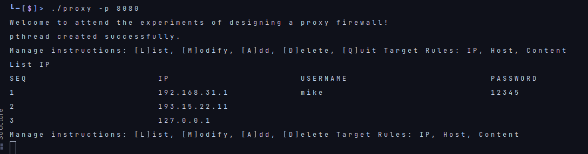
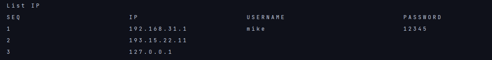
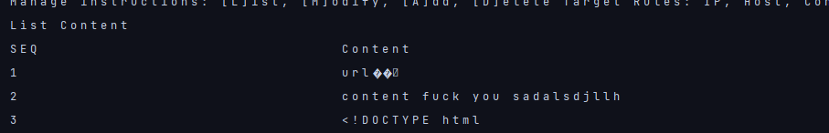
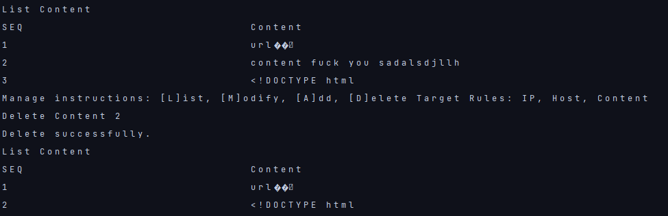
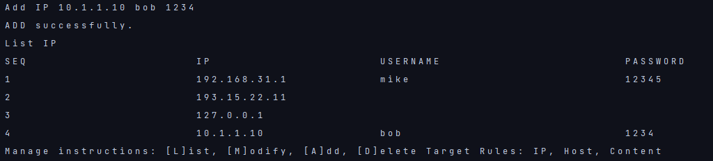
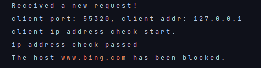
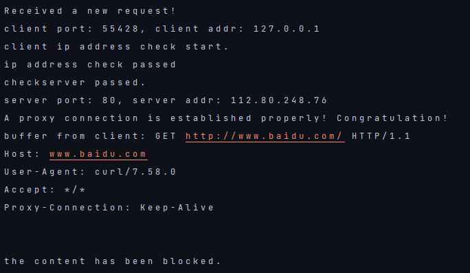
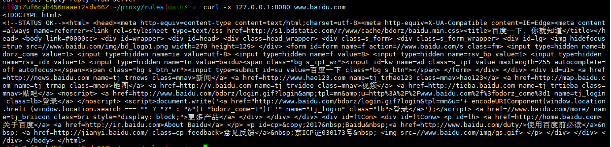

# proxy

## 编译
```
mkdir rules
touch ip content hostname
make clean && make
```

## 配置规则
* Add target
* Modify target
* Delete target seq   
* List target
* Quit

target 包括 Content, Host, IP

seq 为 List中指定的序号

IP的输入规则:
`` ip username password``
若无需用户验证，则用None代替username和password

## 测试：

使用curl
```asm
curl -x serveraddr:port desthost    //通过serveraddr上的指定代理访问目标服务器
curl -u username:passwd -x serveraddr:port desthost  //使用Authorization用户验证
```

* List IP


* List Host
  
  
* List Content

  

* Delete Content

  

* Add IP
  

* Host

  
  
* Content

  
  
* 正常

  
  